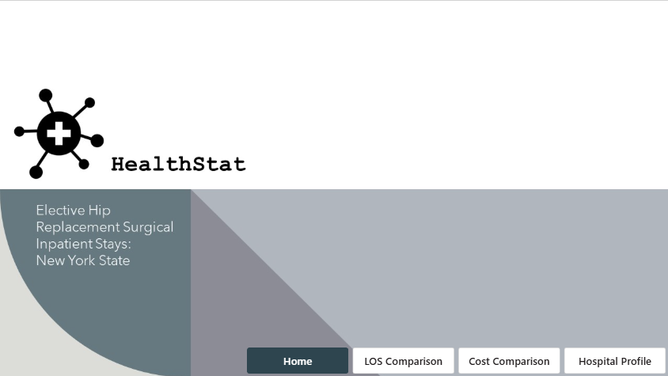
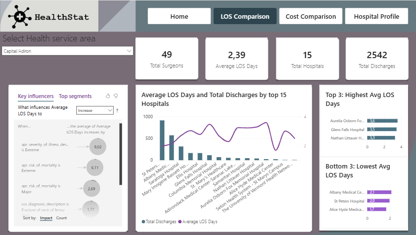
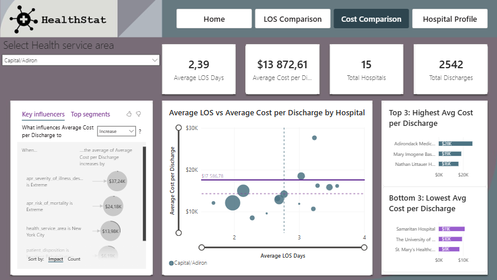
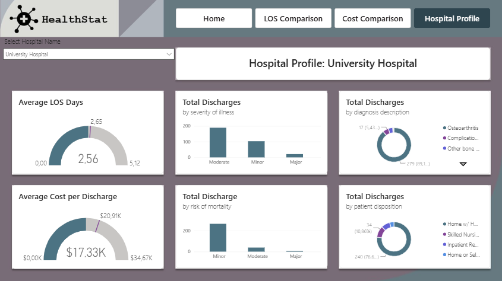

## 📄 Dashboard Pages

### 🏠 Home

The landing page provides navigation to the main sections of the report.

### ⏱️ LOS Comparison

This page focuses on comparing hospitals based on **Length of Stay (LOS)** and operational metrics.

Key metrics include:

- Average Length of Stay
- Total Discharges
- Total Surgeons
- Number of Hospitals
- Variance from the overall average

The page also includes a **Key Influencers** analysis to identify factors that may contribute to differences in patient Length of Stay.

### 💰 Cost Comparison

This page analyzes healthcare costs and hospital efficiency.

Key metrics include:

- Average Cost per Discharge
- Average Length of Stay
- Total Discharges
- Hospital comparisons
- Healthcare Service Area analysis

A scatter plot is used to explore the relationship between:

- Average Cost per Discharge
- Average Length of Stay
- Number of Discharges

### 🏥 Hospital Profile

This page provides a detailed profile of a selected hospital.

The analysis includes:

- Average Length of Stay compared with the overall average
- Average Cost per Discharge compared with the overall average
- Discharges by Severity of Illness
- Discharges by Risk of Mortality
- Diagnosis distribution
- Patient Disposition
